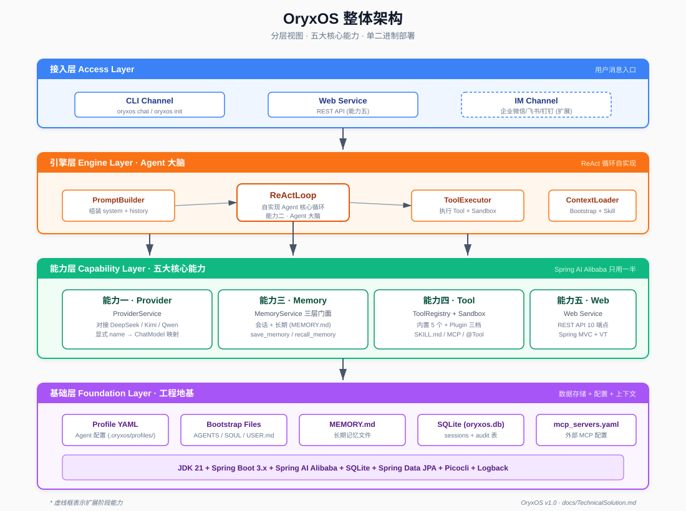
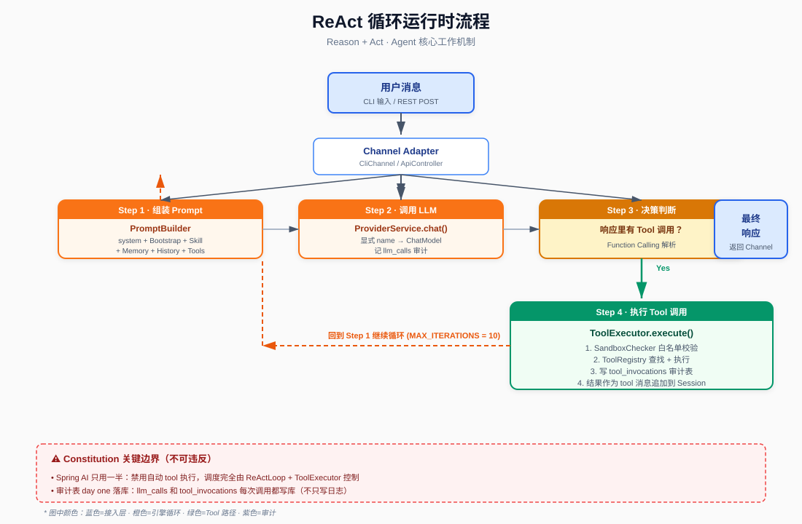

# CLAUDE.md

This file provides guidance to Claude Code (claude.ai/code) when working with code in this repository.

## 项目状态

OryxOS 处于**完全 greenfield 阶段**：仓库里目前只有 4 份设计文档，**没有任何代码**。所有架构、技术选型、模块边界已经定型，开发进入编码阶段时按 `AiProgrammingGuide.md` 用 Spec-Kit 跑主体开发。

> **写代码前先读这 4 份文档**（位于 [`docs/`](docs/) 目录，顺序如下），它们是单一事实来源，文档之间互相引用、自洽闭环：

| 文档 | 回答的问题 | 大小 |
|---|---|---|
| `docs/IndustryResearch.md` | Why — 业界判断、定位论证 | ~363 行 |
| `docs/DemandAnalysis.md` | What — 功能需求 + 非功能需求 + 验收 | ~656 行 |
| `docs/TechnicalSolution.md` | How — 技术栈、架构、模块设计 | ~548 行 |
| `docs/AiProgrammingGuide.md` | How to AI — Spec-Kit 流程、user story 拆 | ~412 行 |

如果文档之间出现冲突，按上面顺序**以后者为准**（越往后越具体）。

---

## 一句话定位

> **OryxOS = 企业完全可控 + Java 原生 + 私有可审计的 Agent 统一底座**

锚在不变的企业刚需上（严监管企业要私有可控、要跟 Java 对齐），不锚在"Agent OS"这个概念上。

**四词定位**：统一、私有、易接入、可观测。

---

## 技术栈（已锁定，不得更改）

- **JDK 21** + Spring Boot 3.x（virtual thread 撑高并发，**不用响应式**）
- Spring AI Alibaba（LLM 调用底层，**只用一半**，见下方"AI Agent 最容易写错的点"）
- **自实现 ReAct loop**（不依赖 Spring AI 的 Agent 抽象）
- SQLite + Spring Data JPA（关系数据 + MEMORY.md 文件做长期记忆）
- Picocli（12 个 CLI 命令）
- MCP Java SDK（MCP Client，社区项目，部分可能要自实现）

**单二进制部署**：fat JAR，扩展阶段再上 GraalVM Native Image。

---

## Constitution 原则（非协商，AI agent 不得自行修改）

来自 `docs/AiProgrammingGuide.md` §3.2。每条 spec / plan / tasks / implement 阶段都要遵守：

> ⚠️ **唯一已记录的偏离**（2026-09-03，owner 显式授权）：第 1 条 "单二进制部署" 在**主页**上不适用——`website/` 走独立的 VitePress + GitHub Pages 部署，不进 fat JAR。运行时（ReAct loop / Provider / Memory / Tool / REST API）仍按 single-binary 走。详见 [`docs/superpowers/specs/2026-09-03-oryxos-homepage-design.md`](docs/superpowers/specs/2026-09-03-oryxos-homepage-design.md) 的 "Constitution Deviation Notice"。

1. **JDK 21 + Spring Boot 3.x** 单体应用，Maven 多模块（9 个），单二进制部署
2. **五大核心能力优先**，支撑模块次之；核心阶段交付运行时内核，企业级治理层（多租户/SSO/完整审计/Tool Policy）放扩展阶段
3. **自实现 ReAct loop**，不直接用 Spring AI 的 Agent 抽象
4. **Spring AI 只用一半**——只用 Provider 抽象、协议转换和 `@Tool` 的 schema 生成；**禁用自动 tool 执行**，tool 调度完全由 `ReActLoop` + `ToolExecutor` 控制
5. **Plugin Tool 三档接入**，主推 SKILL.md + MCP 零代码方式
6. **核心阶段 SQLite + MEMORY.md**，向量检索放扩展；**审计表 day one 落库**（`tool_invocations` + `llm_calls`）
7. 每个 user story 完成后**有可演示 demo**，优先级是跑通而非完美

---

## 🚨 AI Agent 最容易写错的点（必须避开）

| # | 错点 | 对的做法 |
|---|---|---|
| 1 | **启用 Spring AI 的自动 tool 执行** | 禁用，只用 Provider 抽象和 schema 生成 |
| 2 | ProviderService 用**类型扫描**区分多个 ChatModel | 维护 provider name → ChatModel 的**显式映射** |
| 3 | Tool 又被拆成多个 Maven 模块 | Tool 相关**三合一**到 `oryxos-tool` 模块 |
| 4 | `SKILL.md` 当成 Tool 处理 | 它是 prompt 输入源，归 `ContextLoader`（在 `oryxos-core`），不是 Tool |
| 5 | Memory 简化成跟 Session 合并 | `MemoryService` 是**三层统一门面**，ReAct 循环只调一个接口 |
| 6 | 审计数据只写日志 | `tool_invocations` 和 `llm_calls` **核心阶段就落库** |
| 7 | 拆 user story 时不按依赖关系 | 按 `docs/AiProgrammingGuide.md` §1.3 的依赖顺序，**不按时间/重要性**拆 |

**遇到 AI agent 偏离 constitution**：立刻让它重读 CLAUDE.md + 上面这份"最容易写错的点"清单，让它改正后再继续。

---

## 架构骨架



### 五大核心能力（核心阶段交付）

| 能力 | 一句话 | 主模块 |
|---|---|---|
| 一 对接 LLM | Provider 抽象，基于 Spring AI Alibaba | `oryxos-provider` |
| 二 ReAct 循环 | Agent 大脑，自实现循环 | `oryxos-core` |
| 三 Memory | 三层记忆（核心做会话+长期两层） | `oryxos-memory` |
| 四 Tool 体系 | 内置 5 个 + Plugin 三档 | `oryxos-tool` |
| 五 Web Service | REST API 10 个核心端点 | `oryxos-web` |

### 9 个 Maven 模块（来自 `docs/TechnicalSolution.md` §10）

```
oryxos-core       # 核心引擎：ReActLoop、PromptBuilder、ToolExecutor、ContextLoader、Session、Profile、OryxTool
oryxos-provider   # 能力一：ProviderService、Function Calling 适配、provider name 映射
oryxos-memory     # 能力三：MemoryService 三层门面、LongTermMemory、MemoryTools
oryxos-tool       # 能力四（三合一）：内置 Tool、MCP Client、ToolRegistry、SandboxChecker
oryxos-web        # 能力五：WebServer、6 个 ApiController、GlobalExceptionHandler、OpenAPI
oryxos-channel-cli# CLI Channel
oryxos-storage    # SQLite 三张表：sessions、tool_invocations、llm_calls
oryxos-cli        # Picocli 12 个命令入口
oryxos-boot       # Spring Boot fat JAR 启动模块
```

模块依赖关系：`oryxos-boot` 依赖所有；`oryxos-core` 是所有能力模块的基础；其他能力模块互不直接依赖，统一通过 `oryxos-core` 的接口解耦。

### 运行时数据流



```
用户消息 → Channel → AgentService.process
  → ReActLoop（组装 Prompt → 调 ProviderService → 解析响应）
       → 若有 Tool 调用：ToolExecutor（SandboxChecker → ToolRegistry → 执行）→ 追加到 Session
       → 达到 MAX_ITERATIONS（默认 10）或无 Tool 调用 → 返回最终响应
```

---

## 开发流程（按 `AiProgrammingGuide.md`）

### 主体开发阶段（用 Spec-Kit）

5 个 user story **按依赖关系**推进，**不按时间/重要性**：

```
US-1 对接 LLM → US-2 ReAct 循环 → ┬ US-3 Memory
                                    └ US-4 Plugin Tool（并行） → US-5 Web Service
```

每个 user story 完成后：
1. 跑一次 `/speckit.analyze` 检查 spec ↔ 代码一致性
2. 对照需求文档第 13 章验收 demo（5 个 demo 对应 5 个 user story）
3. git commit 标记 user story 完成

### 增量开发阶段（切手动提示词）

主体开发完成后，**切换到手动提示词配合 Claude Code**。Spec-Kit 流程对单文件小增量过重，社区接力走轻量流程。

### Spec-Kit artifact 准备阶段（一次性）

`docs/AiProgrammingGuide.md` §3 详述。主体开发前一次性生成：

- `.specify/memory/constitution.md`（7 条原则，AI 必读）
- `spec.md`（5 个 user story，对应五大核心能力）
- `plan.md`（技术栈 + 9 模块 + 关键技术决策）
- `.specify/memory/` 目录结构

**喂 Spec-Kit 时务必用最新版的 4 份文档**（位于 `docs/`），否则生成的 plan 会按错误的模块数（11 个而非 9 个）拆分。

---

## 关键约定

- **核心阶段 4 周 12 小时**（每周 3 小时），范围卡得很紧，跑通优先
- **核心阶段交付运行时内核**，企业级治理层（多租户、SSO、完整审计、Tool Policy）放扩展阶段
- **不做**：可视化工作流编排（让给 Dify）、Tool 调用并行、流式响应 SSE、Tool Policy 完整版、向量检索、Docker Sandbox
- **5 个验收 demo 是核心阶段发布的硬条件**，缺一不可

---

## 工程风险（来自 `TechnicalSolution.md`）

- **SQLite `ALTER TABLE` 能力有限**：`hibernate.ddl-auto=update` 对表结构演进支持很弱。核心阶段首次建表用 update 可以，后续演进要手动维护脚本或引入 Flyway/Liquibase
- **Java MCP Client 生态成熟度不如 Python**：stdio transport 可能遇到 process 启动、stdin/stdout 编码问题；US-4 实施 MCP 前先用一个最简 MCP server 测连通性
- **Java 启动慢**：核心阶段先吃这个体验，扩展阶段用 GraalVM Native Image 压到接近原生

---

## 相关文件位置

- 4 份设计文档：`docs/*.md`
- 工作区（用户执行 `oryxos init` 后创建）：`.oryxos/`（profiles/、memory/、skills/、sessions/、logs/、AGENTS.md、SOUL.md、USER.md、mcp_servers.yaml、oryxos.db）
- 配置文件：`application.yaml`、`.oryxos/profiles/*.yaml`、`.oryxos/mcp_servers.yaml`
- SQLite 数据库：`.oryxos/oryxos.db`
- **主页（公开网站）**：`website/` —— VitePress 静态站点 + GitHub Pages 部署（与运行时独立部署，⚠️ 见 Constitution 偏离声明）。设计 spec：`docs/superpowers/specs/2026-09-03-oryxos-homepage-design.md`；实施 plan：`docs/superpowers/plans/2026-09-03-oryxos-homepage.md`
- **GitHub Actions 部署工作流**：`.github/workflows/deploy-website.yml`（仅 deploy `website/`，不动 runtime）